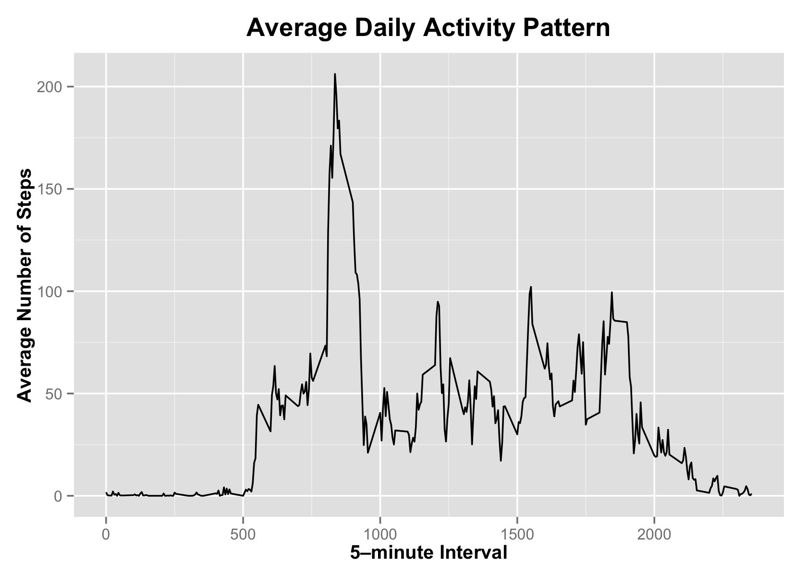

# Reproducible Research: Peer Assessment 1

## Loading useful packages

```r
suppressMessages(library(dplyr))
library(lubridate)
library(scales)
library(grid)
library(ggplot2)
```

## Loading and preprocessing the data

```r
activity <- read.csv("activity.csv", header = TRUE, 
                     colClasses = c("numeric", "Date", "numeric"))
```


## What is mean total number of steps taken per day?

We first compute the total number of steps taken each day throught the given period, omitting any missing values. Using the new data frame, we compute the mean and the median of total number of steps.


```r
activity_by_day <- aggregate(steps ~ date, activity, sum)
meanSteps <- with(activity_by_day, mean(steps))
medianSteps <- with(activity_by_day, median(steps))
```

The mean is **10766.19** and the median is **10765**. The histogram of the total number of steps per day is shown below:


```r
h <- ggplot(data = activity_by_day, aes(steps))
h <- h + geom_histogram(binwidth = 3000, 
                          fill = "cyan4", colour = "coral3", alpha = 0.7) +
    scale_x_continuous(limits = c(0,25000)) + 
    geom_vline(aes(xintercept = meanSteps), 
               colour = "red", linetype = 2, size = 0.8) +
    labs(title = "Total Number of Steps per Day \n (missing values ignored)", x = "Steps", y = "Frequency") +
    theme(plot.title = element_text(size = 16, face = "bold", vjust = 1.5))
print(h)
```

 

## What is the average daily activity pattern?

We transform the data frame by computing the average number of steps taken per 5-minute interval across all days:


```r
activity_by_interval <- aggregate(x = list(avsteps = activity$steps),
                                  by = list(interval = activity$interval),
                                  FUN = mean, na.rm = TRUE)
```

Plotting the result as a time-series graph:


```r
g <- ggplot(data = activity_by_interval, aes(x = interval, y = avsteps))
g <- g + geom_line() +
    labs(title = "Average Daily Activity Pattern",
         x = "5–minute Interval",
         y = "Average Number of Steps") + 
    theme(plot.title = element_text(size = 16, face = "bold", vjust = 1.5),
          axis.title = element_text(face = "bold"))
print(g)
```

 

Compute the interval when, on average across all days, the maximum number of steps occurs:


```r
maxStepsInterval <- activity_by_interval[which.max(activity_by_interval$avsteps), "interval"]
```

Therefore, the maximum number of steps is taken at **8:35**.

## Imputing missing values
The fact that we ignored missing values in the previous computations most likely introduced some bias. Check what is the total number of missing values in the dataset:


```r
countNA <- apply(is.na(activity), 2, sum)
countNA
```

```
##    steps     date interval 
##     2304        0        0
```

As we can see, there are **2304** missing values for "steps" variable only. As a strategy for filling in these blanks, we are going to use the average number of steps for the 5–minute interval. To do that, we first merge the original dataset with the one containing the mean for 5–minute interval, and then substitute NA values for the corresponding values in the mean column.


```r
activityComplete <- merge(activity, activity_by_interval, by = "interval", 
                             sort = FALSE) %>%
    arrange(date)
activityComplete[is.na(activityComplete)] <- activityComplete[which(is.na(activityComplete$steps)),"avsteps"]
head(select(activityComplete, -avsteps))
```

```
##   interval     steps       date
## 1        0 1.7169811 2012-10-01
## 2        5 0.3396226 2012-10-01
## 3       10 0.1320755 2012-10-01
## 4       15 0.1509434 2012-10-01
## 5       20 0.0754717 2012-10-01
## 6       25 2.0943396 2012-10-01
```

Recomputing the total number of steps per day, as well as mean and median:


```r
activityComplete_by_day <- aggregate(steps ~ date, activityComplete, sum)
new_mean <- mean(activityComplete_by_day$steps)
new_median <- median(activityComplete_by_day$steps)
```

The mean is **10766.19** and the median is also **10766.19**. As expected, these values are slightly higher than in the case of ignored NAs, but not drastically. The shape of the histogram is also similar to the original one:


```r
h1 <- ggplot(data = activityComplete_by_day, aes(steps))
h1 <- h1 + geom_histogram(binwidth = 3000, 
                          fill = "seagreen", colour = "salmon", alpha = 0.7) +
    scale_x_continuous(limits = c(0,25000)) + 
    labs(title = "Total Number of Steps per Day", x = "Steps", y = "Frequency") +
    theme(plot.title = element_text(size = 16, face = "bold", vjust = 1.5))
print(h1)
```

 

## Are there differences in activity patterns between weekdays and weekends?

To answer this question, we add a factor variable "day" to the filled dataset with levels "weekday" and "weekend", and then aggregate the data by 5–minute interval to compute the average number of steps across weekdays and weekends separely.


```r
activity_by_weekdays <- mutate(activityComplete,
                               day = as.factor(ifelse(wday(date) %in% c(1,7),
                                                      "weekend", "weekday"))) %>%
    group_by(interval, day) %>%
    summarise(avsteps = mean(steps))
head(activity_by_weekdays)
```

```
## Source: local data frame [6 x 3]
## Groups: interval
## 
##   interval     day    avsteps
## 1        0 weekday 2.25115304
## 2        0 weekend 0.21462264
## 3        5 weekday 0.44528302
## 4        5 weekend 0.04245283
## 5       10 weekday 0.17316562
## 6       10 weekend 0.01650943
```


We then reconstruct the time series plot:


```r
g1 <- ggplot(data = activity_by_weekdays, aes(interval, avsteps, colour = day))
g1 <- g1 + geom_line() + 
    facet_wrap(~ day, ncol = 1) +
    scale_x_continuous(breaks = seq(0, 2355, 240)) + 
    labs(title = "Average Daily Activity Pattern by Day of Week",
         x = "5–minute Interval",
         y = "Average Number of Steps") + 
    theme(plot.title = element_text(size = 16, face = "bold"),
          axis.title = element_text(face = "bold"),
          legend.position = "top",
          legend.title = element_blank(),
          panel.margin = unit(0, "lines"))
print(g1)
```

 

By looking at the plot, we can conclude that there is indeed a difference in activity pattern between weekdays and weekends. There is a peak in activity during weekdays around 8:30 and less activity throught the rest of the day, while the average number of steps per interval is more evenly distributed over weekends (from 7:20 to about 22:00).
